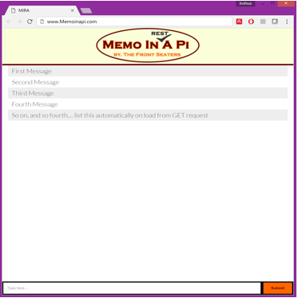

# Memo in A Pi

## Project Description
We set out to create a social media site similar to Yik-Yak where posts are location based. Users that connect to Memo in a pi will be able to access a Web App to view and post messages based on the location of their access point. We want to provide our users with a location based social media outlet that does not detract from their environment.  

## Beacon Pi
The beacon pi will broadcast a Bluetooth connection to users’ nearby smart devices using the Bluez library. Each beacon pi will provide a token unique to its current location. Users can post to and access content from the server pi via a Web App and the provided token.

## Web Application
We decided to use a Web App to increase accessibility. While an Android or iOS Application would be limited to their respective devices, a Web App can be used by any internet-connected device. Our Web App features a graphical user interface that enables users to view and post content. The application performs these actions by making GET and POST requests to the server pi using a RESTful interface.

## Server
The server is hosted on a Raspberry Pi that stores messages in a database using MongoDB. All GET and POST requests from the Web App will either access content from or write content into the database. For manageability purposes, the database deletes messages that are older than 24 hours and holds a maximum of 100 messages.  The server is able to decipher the unique token in each GET and POST request. The server’s responses will only contain messages with the same token as was contained in the request.

## RESTful API
The server processes user interaction through GET and POST requests from the Web App. All requests contain the token associated with the user’s access point. Responses to a GET request will only contain messages that are relevant to the user’s access point. A POST request is used to upload a message to the server by a user. Once the message has been uploaded, it can be viewed by other users in the same location.
